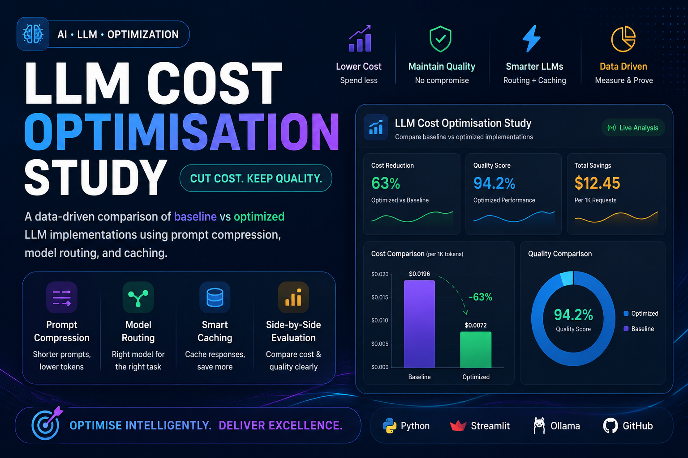

<p align="center">
  
</p>

<h1 align="center">💰 LLM Cost Optimisation Study</h1>

<p align="center">
  <b>Reduce LLM costs without materially hurting response quality.</b>
</p>

<p align="center">
  A practical Generative AI study demonstrating prompt compression,
  model routing, response caching, token reduction, cost analysis,
  and quality evaluation.
</p>

<p align="center">
  <a href="https://llm-cost-optimisation-r9jrfo3yrfuuqrxs9e2xhg.streamlit.app/">
    
  </a>
</p>

<p align="center">
  
  
  
  
  
</p>

---

# 💰 LLM Cost Optimisation Study

## 🎯 Overview

**LLM Cost Optimisation Study** is a Generative AI project that explores practical techniques for reducing the operational cost of Large Language Model applications while maintaining or improving response quality.

The project compares two implementations:

* 🔴 **Baseline Implementation** — traditional LLM approach
* 🟢 **Optimized Implementation** — applies multiple cost-optimization strategies

The dashboard measures token usage, estimated cost, quality, caching performance, savings, and projected monthly expenses.

> **Core idea:** LLM optimization is not only about choosing a cheaper model. Effective optimization combines better prompts, intelligent model selection, caching, fewer tokens, and continuous quality evaluation.

---

# ✨ Key Features

| Feature                  | Description                                              |
| ------------------------ | -------------------------------------------------------- |
| ✂️ Prompt Compression    | Removes unnecessary instructions and reduces prompt size |
| 🤖 Model Routing         | Routes requests according to their complexity            |
| ⚡ Response Caching       | Reuses responses for repeated questions                  |
| 📉 Token Reduction       | Measures token savings between implementations           |
| 🎯 Quality Evaluation    | Compares baseline and optimized response quality         |
| 💰 Cost Analysis         | Calculates estimated LLM benchmark costs                 |
| 📊 Cost Comparison       | Compares baseline vs optimized performance               |
| 📅 Monthly Projection    | Estimates monthly cost and potential savings             |
| 🏆 Recommendation Engine | Determines whether optimization should be adopted        |
| 📈 Experiment History    | Tracks optimization experiments during the session       |
| 📥 CSV Export            | Exports benchmark results for analysis                   |
| 🦙 Local LLM             | Supports local inference through Ollama                  |
| ☁️ Streamlit Dashboard   | Interactive web-based analytics interface                |

---

# 📊 Benchmark Results

A benchmark experiment was performed using the question:

> **How can I reset my password?**

The baseline and optimized implementations were compared using token usage, estimated benchmark cost, and response quality.

### 🔴 Baseline vs 🟢 Optimized

| Metric                | 🔴 Baseline |   🟢 Optimized |
| --------------------- | ----------: | -------------: |
| Token Usage           |         736 |         **96** |
| Token Reduction       |           — |     **86.96%** |
| Cost / 1,000 Requests |     $1.0504 |    **$0.1236** |
| Cost Reduction        |           — |     **88.23%** |
| Quality Score         |    80 / 100 |   **90 / 100** |
| Quality Change        |           — | **+10 points** |
| Cache Status          |           — |           MISS |

### 🏆 Benchmark Outcome

The optimized implementation achieved:

```text
📉 86.96% Token Reduction
💰 88.23% Cost Reduction
🎯 +10 Quality Improvement
```

### Recommendation

> 🟢 **RECOMMEND OPTIMIZED**

The experiment demonstrated that the optimized implementation significantly reduced estimated cost and token usage while improving the measured quality score.

---

# 🧠 Optimization Pipeline

```text
                         👤 User Question
                                │
                                ▼
                       📝 Input Processing
                                │
                 ┌──────────────┴──────────────┐
                 │                             │
                 ▼                             ▼
          🔴 BASELINE                    🟢 OPTIMIZED
                 │                             │
                 │                    ✂️ Prompt Compression
                 │                             │
                 │                    🤖 Model Routing
                 │                             │
                 │                    ⚡ Response Cache
                 │                             │
                 ▼                             ▼
          LLM Generation                LLM Generation
                 │                             │
                 └──────────────┬──────────────┘
                                ▼
                       🎯 Quality Evaluation
                                │
                                ▼
                         📊 Cost Analysis
                                │
                                ▼
                      🏆 Final Recommendation
```

---

# ✂️ Optimization Techniques

## 1. ✂️ Prompt Compression

Long prompts can unnecessarily increase input token usage.

The optimized implementation removes redundant instructions while preserving the important requirements of the task.

```text
Long Prompt
     ↓
Remove unnecessary instructions
     ↓
Shorter Prompt
     ↓
Fewer Input Tokens
     ↓
Lower Cost
```

### Benefits

* 📉 Fewer input tokens
* 💰 Lower estimated cost
* ⚡ Faster processing
* 🎯 Preserved task requirements

---

## 2. 🤖 Model Routing

Not every user request requires the most powerful model.

The system can route requests according to their complexity.

```text
Simple Question
      ↓
Smaller / Faster Model
      ↓
Lower Cost


Complex Question
      ↓
Stronger Model
      ↓
Better Reasoning
```

The goal is to balance:

**Cost + Speed + Quality**

---

## 3. ⚡ Response Caching

Repeated questions do not always require a new LLM generation.

The application stores generated responses in memory and can reuse them when the same request is received again.

```text
                     User Question
                          │
                          ▼
                     Check Cache
                          │
                ┌─────────┴─────────┐
                │                   │
              CACHE HIT          CACHE MISS
                │                   │
                ▼                   ▼
          Return Cached         Generate Response
             Answer                   │
                                     ▼
                                Store Response
                                     │
                                     ▼
                                Return Answer
```

### Cache Benefits

* ⚡ Faster responses
* 💰 Reduced generation cost
* 📉 Avoids unnecessary token generation
* 🚀 Improved application efficiency

### Example

```text
First Request
     ↓
Cache MISS
     ↓
LLM Generation
     ↓
Store Response


Same Request Again
     ↓
Cache HIT ⚡
     ↓
Return Cached Answer
     ↓
No New LLM Generation
```

---

# 📉 Token Reduction

Token usage is measured for both implementations.

### Formula

```text
Token Reduction (%)
=
(Baseline Tokens - Optimized Tokens)
------------------------------------ × 100
        Baseline Tokens
```

### Benchmark

```text
Baseline Tokens     = 736
Optimized Tokens    = 96

Token Reduction     = 86.96%
```

This demonstrates how prompt optimization, model routing, and efficient generation can substantially reduce token usage.

---

# 💰 Cost Analysis

The dashboard converts recorded token usage into an estimated benchmark cost.

The application provides:

* 💵 Baseline cost
* 💵 Optimized cost
* 💸 Cost savings
* 📊 Cost per 1,000 requests
* 📅 Monthly projected cost
* 💰 Monthly savings

### Benchmark

```text
Baseline
$1.0504 / 1,000 requests

Optimized
$0.1236 / 1,000 requests
```

### Estimated Saving

```text
$1.0504 - $0.1236
= $0.9268 saved / 1,000 requests
```

---

# 📅 Monthly Cost Projection

The dashboard allows users to enter an expected monthly request volume.

### Example

```text
Monthly Requests = 10,000
```

Projected results:

```text
🔴 Baseline Monthly Cost
$10.50

🟢 Optimized Monthly Cost
$1.24

💰 Monthly Saving
$9.27
```

This demonstrates how relatively small savings per request can become significant when an LLM application operates at scale.

---

# 🎯 Quality Evaluation

Reducing cost is not useful if response quality becomes unacceptable.

Therefore, the project evaluates both:

```text
💰 Cost
     +
🎯 Quality
```

### Benchmark Quality

```text
🔴 Baseline Quality
80 / 100

🟢 Optimized Quality
90 / 100
```

### Result

```text
Quality Change = +10 points
```

In this experiment, optimization reduced estimated cost while improving the measured quality score.

---

# 🏆 Recommendation Engine

The application automatically evaluates the optimization trade-off.

For the benchmark:

```text
Cost Reduction     → 88.23%
Token Reduction    → 86.96%
Quality Change     → +10 points
Monthly Saving     → $9.27
```

### Final Recommendation

```text
🟢 RECOMMEND OPTIMIZED
```

The recommendation is based on the measured relationship between cost reduction and response quality.

---

# 📊 Interactive Dashboard

The Streamlit dashboard provides an interactive interface for analyzing optimization experiments.

### 📈 Performance Metrics

* Baseline token usage
* Optimized token usage
* Token reduction
* Baseline cost
* Optimized cost
* Cost reduction

### 🎯 Quality Analysis

* Baseline quality
* Optimized quality
* Quality change
* Quality/cost trade-off

### 💰 Cost Analysis

* Cost per 1,000 requests
* Savings per 1,000 requests
* Monthly projected cost
* Monthly projected savings

### 📈 Experiment History

Multiple experiments can be recorded during the current Streamlit session.

---

# 📥 CSV Export

The application supports exporting experiment results as CSV for further analysis.

Exported results can include:

```text
Question
Baseline Tokens
Optimized Tokens
Token Reduction
Baseline Cost
Optimized Cost
Cost Reduction
Baseline Quality
Optimized Quality
Quality Change
Cache Status
```

This makes it easier to analyze, compare, and document optimization experiments.

---

# 🛠️ Technologies Used

| Technology                   | Purpose                      |
| ---------------------------- | ---------------------------- |
| 🐍 Python                    | Application development      |
| 🎈 Streamlit                 | Interactive dashboard        |
| 🦙 Ollama                    | Local LLM inference          |
| 🐼 Pandas                    | Data analysis and CSV export |
| 🧠 LLM                       | Natural-language generation  |
| 📊 CSV                       | Experiment result storage    |
| 🐙 GitHub                    | Version control              |
| ☁️ Streamlit Community Cloud | Deployment                   |

---

# 🧠 Concepts Demonstrated

This project demonstrates practical understanding of:

* 🤖 Artificial Intelligence
* 🧠 Generative AI
* 💬 Large Language Models
* 💰 LLM Cost Optimization
* ✂️ Prompt Engineering
* ✂️ Prompt Compression
* 🤖 Model Routing
* ⚡ Response Caching
* 📉 Token Economics
* 🎯 LLM Evaluation
* 📊 Quality Measurement
* 💰 Cost Analysis
* 📈 Performance Optimization
* 🐍 Python Development
* 🎈 Streamlit Application Development
* 🦙 Local LLM Deployment
* ☁️ Cloud Deployment

---

# 📂 Project Structure

```text
LLM-Cost-Optimisation/
│
├── 📄 app.py
├── 📄 baseline.py
├── 📄 optimized.py
├── 📄 evaluator.py
├── 📄 cost_analysis.py
├── 📄 requirements.txt
├── 📄 .env.example
├── 📄 .gitignore
├── 🖼️ LLM.png
├── 📄 README.md
│
└── 📁 data/
    └── 📄 test_questions.json
```

---

# 📄 File Description

### `app.py`

Main Streamlit application containing:

* User interface
* Baseline vs optimized comparison
* Cost analysis
* Quality evaluation
* Response caching
* Monthly projection
* Experiment history
* CSV export

### `baseline.py`

Contains the baseline LLM implementation used as the original benchmark.

### `optimized.py`

Contains the optimized implementation using techniques such as:

* Prompt compression
* Model routing
* Response caching

### `evaluator.py`

Handles response quality evaluation and comparison.

### `cost_analysis.py`

Calculates:

* Token usage
* Benchmark cost
* Cost reduction
* Savings
* Monthly projections

### `data/test_questions.json`

Contains sample questions used for optimization experiments.

### `LLM.png`

Project banner displayed at the top of the GitHub README.

---

# 🚀 Getting Started

## 1️⃣ Clone the Repository

```bash
git clone YOUR_GITHUB_REPOSITORY_URL
```

## 2️⃣ Open the Project

```bash
cd LLM-Cost-Optimisation
```

## 3️⃣ Create a Virtual Environment

```bash
python -m venv .venv
```

### Windows

```bash
.venv\Scripts\activate
```

## 4️⃣ Install Dependencies

```bash
pip install -r requirements.txt
```

## 5️⃣ Install Ollama

Install Ollama and make sure the required local model is available.

Check installed models:

```bash
ollama list
```

If required, pull your selected model using Ollama.

## 6️⃣ Run the Application

```bash
python -m streamlit run app.py
```

## 7️⃣ Open in Browser

```text
http://localhost:8501
```

---

# 🌐 Live Demo

<p align="center">
  <a href="https://llm-cost-optimisation-r9jrfo3yrfuuqrxs9e2xhg.streamlit.app/">
    
  </a>
</p>

**Live Application:**

https://llm-cost-optimisation-r9jrfo3yrfuuqrxs9e2xhg.streamlit.app/

---

# ☁️ Deployment

The project is deployed using **Streamlit Community Cloud**.

```text
🐍 Python
    ↓
🧠 LLM Application
    ↓
🎈 Streamlit
    ↓
🐙 GitHub
    ↓
☁️ Streamlit Community Cloud
    ↓
🌐 Live Application
```

> **Note:** Local development can use Ollama for local LLM inference. Cloud deployment may require a cloud-compatible inference configuration depending on the selected model and deployment environment.

---

# 🎯 Project Objectives

The main objectives of this project are to:

* 💰 Reduce LLM inference costs
* 📉 Reduce unnecessary token usage
* ✂️ Optimize prompts
* 🤖 Route requests intelligently
* ⚡ Implement response caching
* 🎯 Measure response quality
* 📊 Compare baseline and optimized implementations
* 📅 Project savings at scale
* 🏆 Generate data-driven optimization recommendations
* 🚀 Build a practical Generative AI project

---

# 💡 Key Takeaway

> **LLM optimization is not simply about using a cheaper model.**

A practical optimization strategy combines:

```text
✂️ Better Prompts
       +
🤖 Smarter Model Selection
       +
⚡ Response Caching
       +
📉 Fewer Tokens
       +
🎯 Quality Evaluation
       ↓
💰 Lower Cost + Better Efficiency
```

The goal is to achieve the best possible balance between:

**Cost + Quality + Speed**

---

# 🔮 Future Improvements

Possible future enhancements include:

* 🤖 Support for additional LLM providers
* 🧠 More advanced model-routing strategies
* 💬 Conversational memory
* 📊 Automated benchmark datasets
* 🎯 Human evaluation alongside automated scoring
* 📈 Statistical experiment analysis
* 🗄️ Persistent experiment database
* 🔍 More sophisticated prompt optimization
* ⚡ Distributed caching
* 📊 Real-time LLM cost monitoring
* 🔐 Authentication and user management
* 🚀 Production-scale deployment

---

# 👩‍💻 About Me

## Tehmina Anwar

**AI/ML Engineer | Python Developer | Generative AI Enthusiast**

I am a Bachelor of Science in Artificial Intelligence student interested in building practical AI and Generative AI applications using Python.

My interests include developing intelligent systems involving Machine Learning, Generative AI, Large Language Models, RAG, NLP, Computer Vision, and AI application development.

### Areas of Interest

* 🐍 Python
* 🤖 Machine Learning
* 🧠 Generative AI
* 💬 Large Language Models
* 🔎 Retrieval-Augmented Generation
* 📝 Natural Language Processing
* 👁️ Computer Vision
* 📊 Data Analytics
* 🚀 AI Application Development

---

# 🔗 Connect With Me

### 💻 GitHub

<a href="https://github.com/Tehmina124">
  
</a>

### 🔗 LinkedIn

<a href="https://www.linkedin.com/in/tehmina-anwar-77b8a8414/">
  
</a>

### 🌐 Portfolio

<a href="https://tehmina-portfolio.vercel.app/">
  
</a>

---

# ⭐ Support

If you found this project useful, consider giving the repository a ⭐ **Star**.

It helps support the project and encourages further development.

---

<p align="center">
  <b>💰 Cut Cost. Keep Quality. Optimise Intelligently.</b>
</p>

<p align="center">
  Built with 🐍 Python • 🎈 Streamlit • 🦙 Ollama • 🐼 Pandas
</p>

<p align="center">
  © 2026 Tehmina Anwar
</p>
